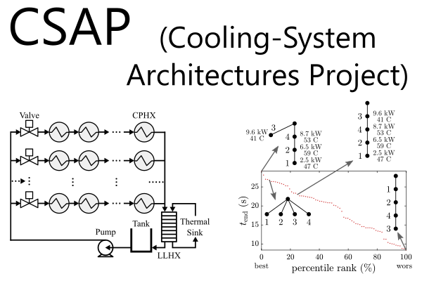

## README (csap)

[](https://github.com/satyartpeddada/csap/releases/latest)
[](https://www.mathworks.com/products/matlab.html)
[](https://github.com/satyartpeddada/csap/issues)
[](https://github.com/satyartpeddada/csap/graphs/contributors)

[](https://github.com/satyartpeddada/csap/blob/master/License)

Investigate single split cooling-system architectures for fluid-based thermal management.



---
### Install
* Download the [project files](https://github.com/satyartpeddada/csap/archive/master.zip)
* Run [INSTALL_CSAP.m](INSTALL_CSAP.m) 
(*automatically adds project files to your MATLAB path, downloads the required files, and opens an example*)

```matlab
INSTALL_CSAP
```
* See [CSAP_IDETC2018_VHBR_Case1_1.m](examples/idetc2018/case1_1/CSAP_IDETC2018_VHBR_Case1_1.m) for an example with problem setup and options
```matlab
open CSAP_IDETC2018_VHBR_Case1_1
```

### Citation
Many elements of this project are discussed in the following paper. Please cite it if you use the project.

* SRT Peddada, DR Herber, HC Pangborn, AG Alleyne, JT Allison. **Optimal flow control and single split architecture exploration for
fluid-based thermal management**. ASME Journal of Mechanical Design, 141(8), p. 083401, Aug 2019, doi: [10.1115/1.4043312](https://doi.org/10.1115/1.4043203), [[PDF]](https://systemdesign.illinois.edu/publications/Peddada2019a.pdf)
	- *Abstract: High-performance cooling is often necessary for thermal management of high power density systems. However, human intuition and experience may not be adequate to identify optimal thermal management designs as systems increase in size and complexity. This article presents an architecture exploration framework for a class of single-phase cooling systems. This class is specified as architectures with multiple cold plates in series or parallel and a single fluid split and junction. Candidate architectures are represented using labeled rooted tree graphs. Dynamic models are automatically generated from these trees using a graph-based thermal modeling framework. Optimal performance is determined by solving an appropriate fluid flow distribution problem, handling temperature constraints in the presence of exogenous heat loads. Rigorous case studies are performed in simulation, with components subject to heterogeneous heat loads and temperature constraints. Results include optimization of thermal endurance for an enumerated set of 4,051 architectures. The framework is also applied to identify cooling system architectures capable of steady-state operation under a given loading.*

### External Includes
See [INSTALL_CSAP.m](INSTALL_CSAP.m) for more information.
* MATLAB File Exchange Submission IDs (23629,40397,51986,65434)

### External Requirements
This project requires the commercial software GPOPS-II. It can be obtained at [gpops2.com](http://www.gpops2.com).

---
### General Information

#### Contributors
* [Satya R. T. Peddada](https://github.com/satyartpeddada)
* [Daniel R. Herber](https://github.com/danielrherber)
* [Herschel C. Pangborn](https://github.com/herschelpangborn)
* Andrew G. Alleyne
* James T. Allison

#### Project Links
* [https://github.com/satyartpeddada/csap](https://github.com/satyartpeddada/csap)
<!-- * [http://www.mathworks.com/matlabcentral/fileexchange/XXXXX](http://www.mathworks.com/matlabcentral/fileexchange/XXXXX) -->
